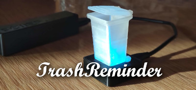
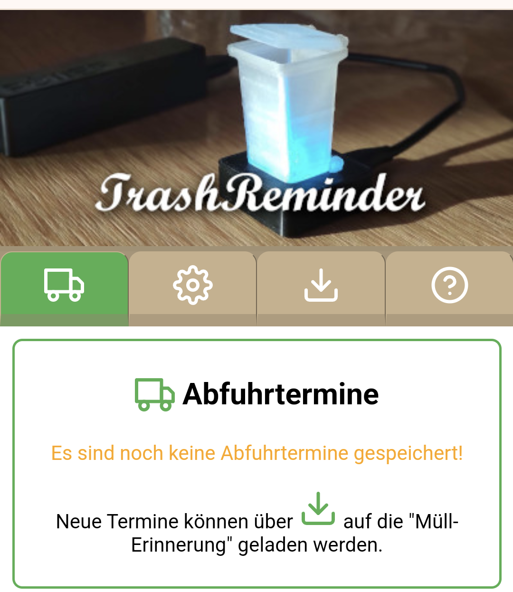
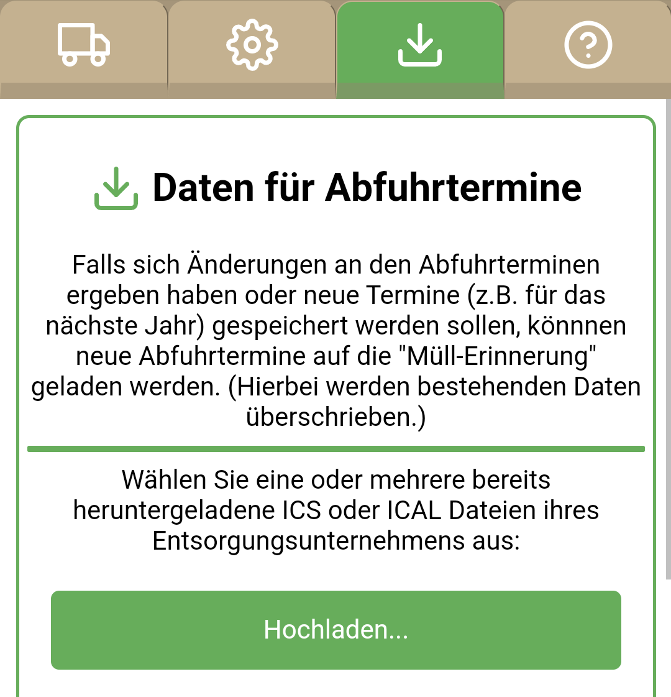
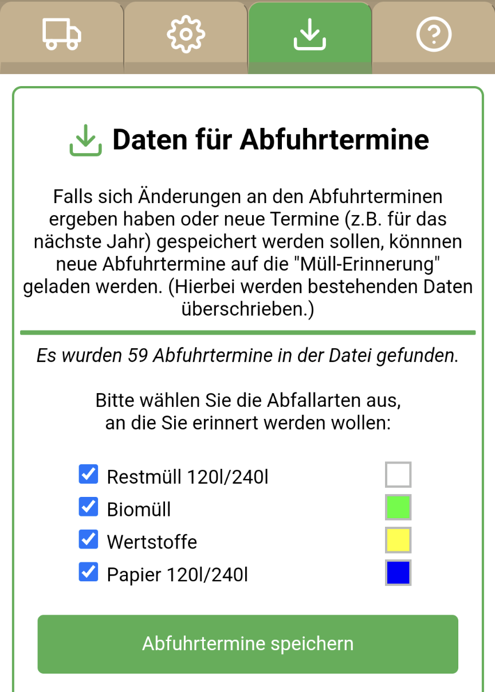
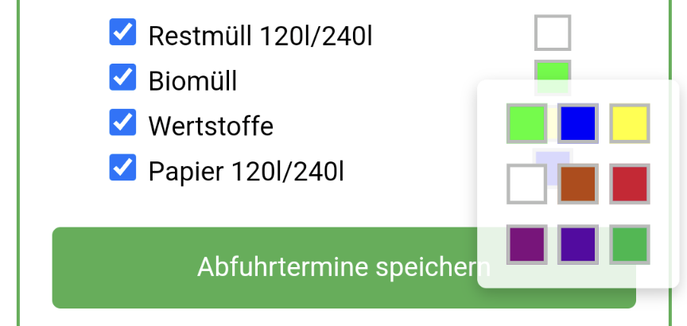
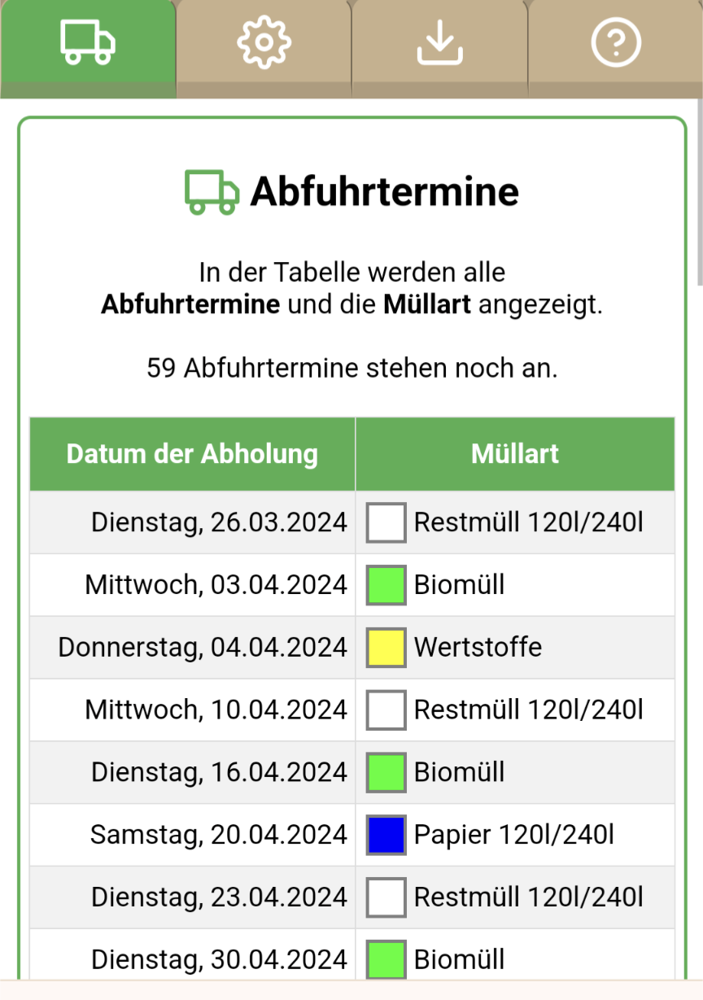
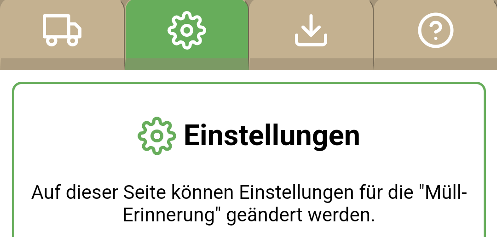
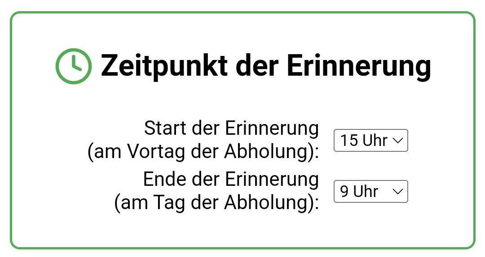
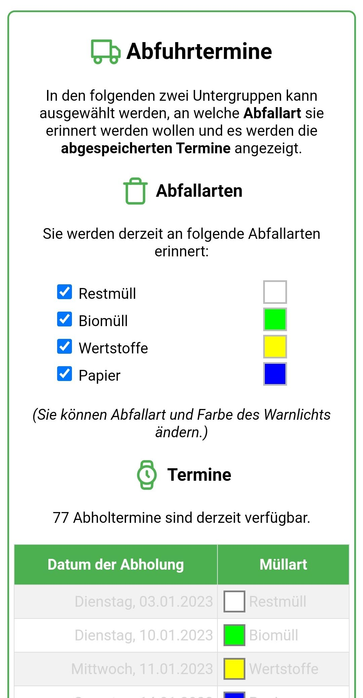

# Müll-Erinnerung

## Schon mal vergessen den Mülleimer rauszustellen?

`TrashReminder` erinnert Dich daran, indem es eine farbig blinkende Erinnerung anzeigt!

Je nach Müllart blinkt das Mülleimermodell in einer unterschiedlichen Farbe:
- `weiß`: Restmüll
- `blau`: Papier
- `grün`: Biomüll/Häckselgut
- `gelb`: Gelber Sack oder Wertstofftonne

Wird also zum Beispiel `Restmüll` abgeholt, blinkt das Mülleimermodell `weiß`.

Sollten am selben Tag **zwei** unterschiedliche Müllarten abgeholt werden, wechselt das Licht zwischen den entsprechenden Farben hin und her. Also zum Beispiel zwischen `weiß` und `grün`, wenn sowohl `Restmüll` als auch `Biomüll` am selben Tag abgeholt werden.

Durch `Anheben des Mülleimermodells` kann das Warnlicht ausgeschaltet werden um mitzuteilen, dass der Mülleimer rausgestellt wurde.

# Einrichten der Müll-Erinnerung

## Verbinden mit dem WLAN
Da das aktuelle Datum und Uhrzeit aus dem Internet ermittelt werden, muss `TrashReminder` mit dem WLAN verbunden werden.

Wenn `TrashReminder` zum ersten mal ans Netzteil angeschlossen wird, leuchtet das Mülleimermodell dauerhaft `rot` um mitzuteilen, dass die einmalige Einrichtung durchgeführt werden muss.

Hierzu muss man sich über das Smartphone mit dem WLAN Netzwerk `TrashReminder` verbinden und im folgenden Dialog
- Heimnetzwerk (SSID) auswählen und das
- Passwort für dieses Netzwerk eingeben.

Jetzt verbindet sich `TrashReminder` mit dem ausgewählten Netzwerk und quittiert die erfolgreiche Verbindung mit einem `Feuerwerk` im Mülleimermodell.

Diese Einrichtung muss nur einmalig durchgeführt werden - von nun an holt sich `TrashReminder` die aktuelle Uhrzeit aus dem Internet und gleicht diese mit eventuell vorliegenden Müllterminen ab, welche dann durch farbiges Blinken des Mülleimermodells mitgeteilt wird.

## Speichern der Abfuhrdaten

Die Abfuhrdaten werden üblicherweise durch das Entsorgungsunternehmen auf einer Webseite im `ICS` oder `ICAL` Format angeboten und müssen zuerst heruntergeladen werden. Suche über einen Browser nach "Abfuhrtermine" oder "Abfallkalender" + Deinem Ort, z.B. ["Abfuhrtermine Stuttgart"](https://www.google.com/search?&q=Abfuhrtermine+Stuttgart). Falls mehrere Abfuhrunternehmen die Abholung übernehmen, können auch mehrere Dateien angegeben werden.

### Beispiele für Müllentsorger
Beispiele für Unternehmen, bei denen ICS Dateien heruntergeladen werden können:

- `Hirrlingen`: https://www.abfall-kreis-tuebingen.de/online-abfuhrtermine/
- `Hirrlingen (Bogenschütz)`: https://www.bogenschuetz-entsorgung.de/blaue-tonne-tuebingen/abfuhrtermine.html
- `Neuweiler/Böblingen`: https://www.lrabb.de/start/Service+_+Verwaltung/Abfuhrtermine.html
- `Stuttgart`: https://service.stuttgart.de/lhs-services/aws/abfallkalender
- `Ebhausen`: https://www.awg-info.de/privatkunden/abfuhrtermine
- `Rheinbach`: https://www.rsag.de/abfallkalender/abfuhrtermine
- `Holzgerlingen`: https://www.awb-bb.de/start/entsorgen/Abfuhrtermine.html
- `Hannover`: https://www.aha-region.de/abholtermine/abfuhrkalender

Hast Du die Abfuhrtermine auf Dein Handy oder Deinen Computer heruntergeladen, müssen diese auf `TrashReminder` gespeichert werden.

Öffne hierzu in Deinem Browser die Adresse [http://TrashReminder](http://TrashReminder).

Klicke auf das Download-Symbol um zur Download-Seite zu wechseln.

Klicke auf `Hochladen...` und wähle eine oder mehrere der herundergeladenen `ICS`/`ICAL` Dateien aus.

Es wird die `Anzahl der gefundenen Termine` und die unterschiedlichen `Müllarten` mit der zugewiesene `Farbe des Warnlichts` angezeigt: 

Optional kann hier ausgewählt werden an welche Müllarten erinnert werden soll und auch mit welcher Farbe (klicke hierzu auf das Farbkästchen):

Ist alles wie gewünscht gesetzt, klicke auf `Abfuhrtermine speichern`.

Nach erfolgreicher Speicherung wechselt `TrashReminder` automatisch zur Ansicht der `Abfuhrtermine`:

Hiermit ist die Einrichtung abgeschlossen - `TrashReminder` wird Dich einen Tag vorher an eine bevorstehende Abholung erinnern!

#Einstellungen

Um Einstellungen für `TrashReminder` durchzuführn, musst Du in Deinem Browser die Adresse [http://TrashReminder](http://TrashReminder) aufrufen.

Wechsele auf das `Zahnrad-Symbol` zur Einstellungsseite:

## Zeitpunkt der Erinnerung
Die Erinnerung erfolgt standardmäßig am **Vortag von 15 Uhr bis 9 Uhr morgens**. Diese Einstellung kann wie über die [Konfigurationsseite](#konfigurationsseite) angepasst werden.

## Ausschalten der Erinnerung
Wenn der Müll rausgestellt wurde, kann die Erinnerung ausgeschaltet werden indem das **Mülleimermodell kurz angehoben** wird. Damit erlischt das Licht bis zur nächsten Abholerinnerung.

Wurde das Mülleimermodell versehentlich angehoben (aber der Müll nicht rausgestellt) kann man entweder 
- den Stecker der Stromversorgung einfach kurz aus- und wieder einstecken oder
- am Ende der [Konfigurationsseite](#konfigurationsseite) die Schaltfläche 'TrashReminder neu starten' auswählen.
Liegt eine aktuelle Erinnerung vor und ist man im Erinnerungszeitraum (15 - 9 Uhr) blinkt das Mülleimermodell wieder wie zuvor.   

## Unterbrechung der WLAN Verbindung
Sollte es zu einer Verbindungsstörung zum Internet kommen, signalisiert `TrashReminder` dies durch ein `schnelles rotes Blinken`. Man muss nichts weiter unternehmen - sobald die Verbindung wieder hergestellt werden kann wechselt `TrashReminder` in den regulären Modus.

## Konfigurationsseite
Die Konfigurationsseite kann über ein Smartphone oder einen Computer über den Link [http://TrashReminder](http://TrashReminder) aufrufen werden.

Über die Konfigurationsseite können folgenden Einstellungen für `TrashReminder` vorgenommen werden:
- Start- und End-Uhrzeit der Erinnerung
- Abfallarten an die erinnert werden soll
- neue Abholtermine auf `TrashReminder` laden

Außerdem werden die derzeit gültigen Abholtermine mit ihrer zugehörigen LED-Farbe angezeigt. Bereits verstrichene Termine werden ausgegraut dargestellt.

### Start- und End-Uhrzeit

Standardmäßig ist
- der Start der Erinnerung auf **15 Uhr** am Vortag der Abholung
- das Ende der Erinnerung auf **9 Uhr** am Tag der Abholung 
gesetzt.
Der jeweilige Zeitpunkt kann über das Auswahlfeld eingestellt werden und wird sofort auf `TrashReminder` übertragen.

### Auswahl der Abfallarten

Für die abgespeicherten Abholtermine kann eingestellt werden an **welche Abfallarten** erinnert werden soll. Ebenso kann hier auch die Farbe des Warnlichts eingestellt werden.

Jede Änderung der Auswahl wird sofort auf `TrashReminder` geladen und die jeweils ausgewählten Einzeltermine entsprechend angezeigt.  

#### Keine zukünftigen Termine vorhanden
Liegen keine zukünftigen Termine mehr vor, signalisiert `TrashReminder` dies durch ein `schnelles pinkes Blinken`.

## Problem Behandlung
- [http://TrashReminder](http://TrashReminder) wird nicht gefunden:
  - Versuche den Link über den Laptop oder ein anderes Smartphone aufzurufen.
  - Versuche einen anderen Browser (manche Browser lassen Verbindungen nicht über `http://` zu)
  - Ermittle die IP-Adresse (192.168.178.x oder ähnlich) der `TrashReminder` und gib sie  in das Browser-Suchfeld ein.
    - Rufe deine Router-Konfiguration (z.B. [http://fritz.box](http://fritz.box)) auf und suche die IP eines Gerätes mit Namen `ESP...`. 
    - Benutze eine Smartphone App wie [Fing](https://play.google.com/store/apps/details?id=com.overlook.android.fing) und suche die IP eines Gerätes mit Namen `ESP...`.  

## Autor
Tobias Werner, Erfindungen aller Art
